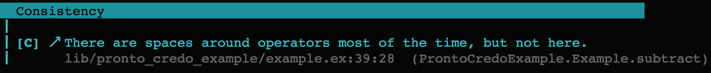
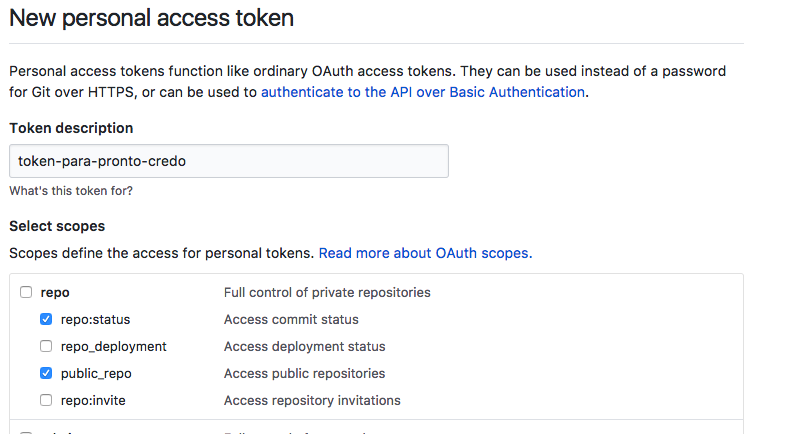
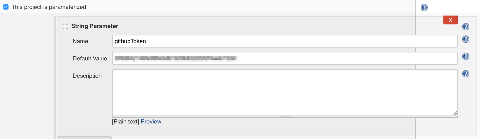
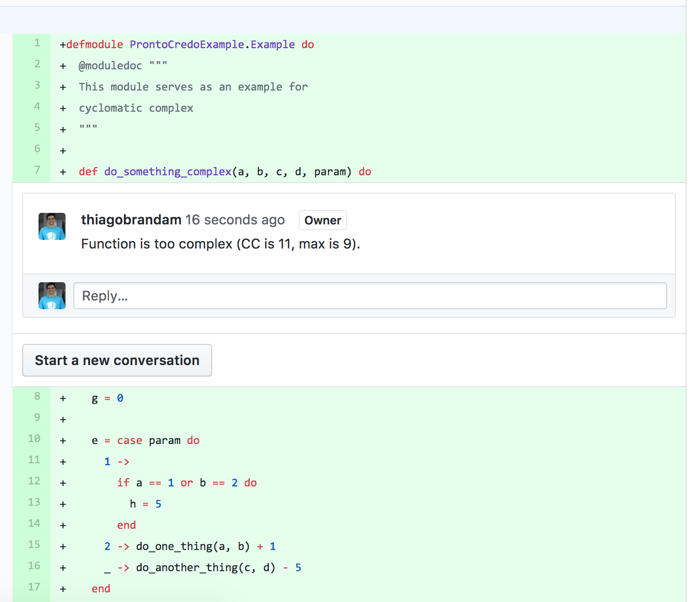

# Como integrar Credo no Github usando Jenkins CI

## Resumo rápido

Neste post vamos explicar como integrar o Credo (um analisador de código estático para Elixir)
para rodar no Jenkins e fazer os avisos gerados por ele aparecerem como comentários nos
pull requests do Github.

## Introdução

Apesar do processo de code review ser uma etapa importante para a manutenção da qualidade do código
e boas práticas de programação, muitas vezes esse processo torna-se um exercício de bike shedding,
no qual o programador que está revisando está mais preocupado em discutir estilo de código do que o design,
 organização ou qualquer outro aspecto do código que precisa ser debatido. Para coisas óbvias e previsíveis como estilo de código, um code linter é a ferramenta mais apropriada.

## Credo

Um code linter é uma ferramenta que analisa código de acordo com regras pré-definidas (o chamado estilo de código). Geralmente a análise (linting) de um código é feita manualmente pelo desenvolvedor, antes dele submeter o código para revisão. O linter é executado na sua cópia local do projeto e um relatório com as incompatibilidades encontradas é gerado, permitindo que ele conserte os possíveis problemas.

Para a linguagem Elixir, existe um analisador de código chamado Credo. Segundo os [mantenedores do projeto](https://github.com/rrrene/credo):

    Credo is a static code analysis tool for the Elixir language with a focus on teaching and code consistency.

O que significa que além das capacidades de um linter usual (isto é, detectar violações em estilos de código padronizados), o Credo também detecta inconsistências no próprio estilo do desenvolvedor. Por exemplo, se em uma parte do código você escolhe separar operadores aritméticos e na outra parte não, isso será exibido no relatório do Credo como um possível problema a ser resolvido:

```
# aqui o operador de soma está separado por um espaço
def add(a, b), do: a + b
# aqui o operador de subtração não está
def subtract(a, b), do: a-b
```

Resultado:



### Instalação do Credo

Para instalar o Credo no seu projeto, adicione as seguintes dependências:

```
defp deps do
  [
    {:credo, "~> 0.8", only: [:dev, :test], runtime: false}
  ]
end
```

E depois rode:

`mix deps.get`

Não esqueça de gerar o arquivo de configuração básica do Credo:

`mix credo gen.config`

Com [ele](https://github.com/rrrene/credo/blob/master/.credo.exs) é possível configurar quais regras (e nível de relaxamento das mesmas) você quer que sejam consideradas no processo de análise de código.

## Pronto

Como foi visto, é comum que o desenvolvedor use ferramentas de análise de código manualmente antes de submeter seu código para revisão. Isso faz com que revisões automáticas de estilo de código dependam do processo de desenvolvimento de cada programador. O ideal é que o processo de análise seja integrado no processo de revisão
de código, como se o linter fosse um revisor extra. Para fazer essa integração no Github, é possível usar o [Pronto](https://github.com/prontolabs/pronto).

Pronto é uma biblioteca em Ruby que foi feita para automatizar reviews no Github. Ela funciona como um intermediário entre o Github e os analisadores de código. Cada analisador de código conversa com a API do Pronto através dos runners. São os runners os responsáveis por processar o relatório dos analisadores e mandar para o Pronto. No caso
do Credo, já existe um runner para o Credo chamado [pronto-credo](https://github.com/carakan/pronto-credo).

Usando o Pronto, será possível levar o relatório gerado pelo Credo como comentários de pull requests do Github, que serão inseridos nos contextos de código onde os próprios problemas foram levantados, da mesma maneira que um colega revisando seu código faria.

### Instalando o Pronto

Para instalar o Pronto e o runner para o Credo, basta executar o seguinte comando:

`gem install pronto pronto-credo`

Nessa etapa é importante lembrar que você tem que ter no seu sistema os arquivos de desenvolvimento para linguagem Ruby porque a gem pronto tem uma dependência compilada em tempo de instalação. No Ubuntu esse pacote chama-se `ruby-dev`. Também deve ser instalado o `cmake`, caso ainda não esteja instalado.

## Jenkins e Credo

Para não depender da boa vontade do programador, é preciso rodar automaticamente o Pronto em algum momento do processo de desenvolvimento. É possível configurá-lo para que rode os runners em uma etapa pré git push usando um git hook, mas no nosso exemplo vamos usar um job de CI como ponto de execução.

Isso é bem conveniente se já existe algum job de CI responsável por rodar a suíte de testes. Esse job é responsável por verificar a sanidade do pull request em termos de teste: o pull request não pode ser mergeado enquanto a suíte de teste passar por inteira. Dessa forma, é possível adicionar uma etapa a mais de análise de código, onde pull request não pode ser mergeado no master se houver violações de estilo de código presentes.

Nesse blog post, será usado o Jenkins como servidor de CI mas a configuração necessária é tão simples que é bem fácil adaptar os passos para outras ferramentas de CI. O Jenkins será usado em modo pipeline, configuração na qual os jobs são descritos em termos de estágios usando uma DSL própria escrita na linguagem Groovy.

### Permissão para criar comentários no Github

Antes de rodar o Pronto, você deve configurar um token de acesso à API de pull requests no Github.

Para criá-lo, vá em https://github.com/settings/tokens/new. Você também pode usar um token existente. O importante é que o token dê acesso ao gerenciamento de repositórios, como mostrado na figura abaixo:




### Configuração no Jenkins

Para facilitar a configuração de um projeto Jenkins, foi feito um [projeto de exemplo](https://github.com/quero-edu/elixir-pronto-credo-example) para servir como guia. É um projeto em Elixir que serve para demonstrar o uso do Credo em um CI Jenkins rodando em modo pipeline. As etapas do pipeline estão descritas no arquivo [Jenkinsfile](https://github.com/quero-edu/elixir-pronto-credo-example/blob/master/Jenkinsfile).

Ao configurar o projeto no Jenkins, certifique-se que ao menos os plugins [Docker](https://wiki.jenkins.io/display/JENKINS/Docker+Pipeline+Plugin) e [Github](https://github.com/KostyaSha/github-integration-plugin) estejam instalados.
O plugin do Docker permite deixar os workspaces do Jenkins intactos. Já o do Github permite configurar um gatilho de job
que é ativado toda vez que uma branch no Github é criada ou modificada.


### Integração do Pronto

Para rodar o Pronto, basta executar o seguinte comando:

```
PRONTO_GITHUB_ACCESS_TOKEN=${githubToken} PRONTO_PULL_REQUEST_ID=${prId} pronto run -f github_pr
```

Devem-se passar duas variáveis de ambiente com os seguintes valores (interpolados pelo Groovy no arquivo do Jenkinsfile):

* `PRONTO_GITHUB_ACCESS_TOKEN=${githubToken}`: `githubToken` é o token de acesso que foi criado anteriormente. Você pode expô-lo usando parâmetros de projeto no Jenkins:



* `PRONTO_PULL_REQUEST_ID=${prId}`: É necessário passar o id do pull request no Github do contrário não é possível criar os comentários no pull request. Como o projeto do Jenkins foi configurado para rodar seguindo o fluxo de branches, é necessário retornar o pull request baseado na branch, fazendo uma chamada para API de pull requests do Github. Essa chamada é feita pela função [`prId`](https://github.com/quero-edu/elixir-pronto-credo-example/blob/master/Jenkinsfile#L30), usando o mesmo `githubToken` definido anteriormente.

O comando acima vai executar o runner do Credo no código que foi adicionado (em comparação com o master) e inserir como comentários os problemas encontrados.

### Resultado

Para ilustrar o uso do Credo no Github, foi adicionado no projeto de exemplo um pedaço de código contendo uma função com [complexidade ciclomática](https://pt.wikipedia.org/wiki/Complexidade_ciclom%C3%A1tica) alta (basicamente uma função que faz mais coisa do que deveria). Isso deverá gatilhar o analisador de acordo com [essa regra](https://github.com/rrrene/credo/blob/master/lib/credo/check/refactor/cyclomatic_complexity.ex).

```
defmodule ProntoCredoExample.Example do
  @moduledoc """
  This module serves as an example for
  cyclomatic complex
  """

  def do_something_complex(a, b, c, d, param) do
    g = 0

    e = case param do
      1 ->
        if a == 1 or b == 2 do
          h = 5
        end
      2 -> do_one_thing(a, b) + 1
      _ -> do_another_thing(c, d) - 5
    end

    f = case param do
      1 ->
        if c == 1 or d == 2 do
          g = 7
        end
      2 -> do_one_thing(a, b) * 8
      _ -> do_yet_another_thing(e, f)
    end

    do_one_last_thing(e, f, g)
  end

  def do_one_thing(a, b), do: a + b
  def do_another_thing(c, d), do: c * d
  def do_yet_another_thing(e, f), do: e - f
  def do_one_last_thing(e, f, g), do: e + 2 * f + 5 * g
end

```


Ao rodar o comando do Pronto no código acima, aparece o seguinte comentário no [pull request](https://github.com/quero-edu/elixir-pronto-credo-example/pull/2):



## Usando Git Hooks para rodar o Pronto

Você também pode usar pronto para analisar seu código em um git hook se preferir que o feedback seja mais rápido.
[Este artigo](http://elliotthilaire.net/gem-pronto-and-git-hooks/) explica como fazer.

## Links

1. [Projeto do Credo no Github](https://github.com/rrrene/credo)
2. [Projeto do Pronto no Github](https://github.com/prontolabs/pronto)
3. [Projeto do Pronto-Credo no Github](https://github.com/carakan/pronto-credo)
4. [Projeto de Exemplo usado no blog post](https://github.com/quero-edu/elixir-pronto-credo-example)
5. [Plugin do Github para Jenkins](https://github.com/KostyaSha/github-integration-plugin)
6. [Documentação do Plugin do Github para gatilho de branches](https://github.com/KostyaSha/github-integration-plugin/blob/master/docs/Configuration.adoc#branch-trigger)
7. [Plugin do Docker para Jenkins](https://wiki.jenkins.io/display/JENKINS/Docker+Pipeline+Plugin)
